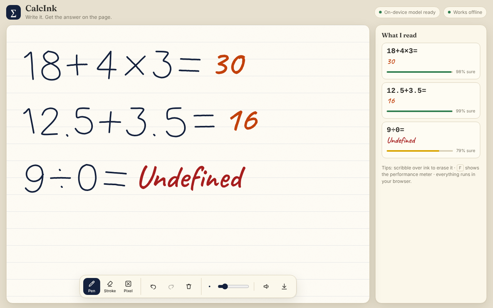
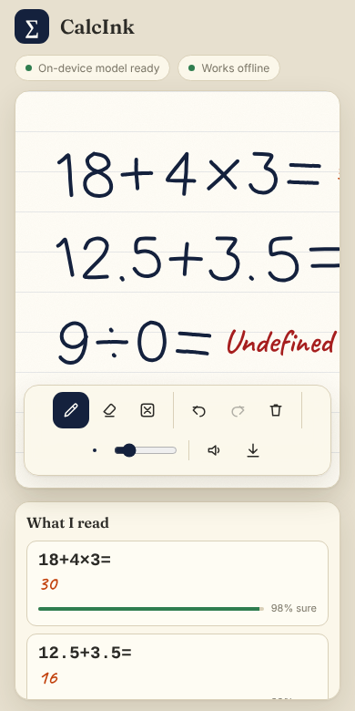

# CalcInk — on-device handwritten math calculator

> Write `18 + 4 × 3 =` with a mouse, stylus or finger and the answer appears on the page, right next to the equals sign. Edit a number and the answer updates. Everything — ink, recognition, math — runs **inside your browser**, with **no network needed after the first load**.



Built for the Inter IIT Tech Meet 15.0 Bootcamp (IIT Guwahati) *CalcInk* problem statement (Software PS, Phase 1).

## Overview

| | |
|---|---|
| Input | Mouse, touch, stylus (pressure + pen-eraser end), palm rejection |
| Recognition | Two open-source pretrained CNNs run with **ONNX Runtime Web (WASM)** in a **Web Worker** |
| Math | Hand-written tokenizer + recursive-descent parser. **No `eval()` anywhere** |
| Offline | Service worker precaches the app, both models and the WASM runtime (~23 MB) |
| Backend | None. Static files only. No API keys, no secrets |

## Features

**Digital-ink canvas** — three stacked canvases (committed ink / projected answers / live stroke), smooth quadratic-curve rendering painted once per animation frame, coalesced pointer events for fast pens, pressure-sensitive width, `devicePixelRatio`-aware backing store (re-scaled on zoom or monitor change), `ResizeObserver` resizing, undo / redo (grouped so one eraser drag = one step), **stroke eraser**, **pixel eraser** (splits strokes), clear, stroke-width slider, PNG export, autosave to `localStorage`.

**Recognition** — digits `0–9`, `+`, `−`, `×`, `÷`, `.`, `=`; multi-digit and decimal numbers; segmentation of strokes into symbols and rows; per-symbol confidence.

**Math** — BODMAS/PEMDAS precedence, multi-digit integers, decimals, unary/negative numbers, `÷0` → **Undefined**, malformed input → **Error**, overflow → **Overflow**. Never throws.

**Reactive editing** — erase or rewrite any symbol and the answer re-evaluates. Only changed symbols are re-classified (cache keyed by stroke ids).

**Extras** — scratch-to-erase (scribble over ink), auto-check (`2+2=5` shows ✗), per-equation confidence bar, "unsure" marker on low-confidence reads, optional sound + haptic feedback, light/dark paper, performance HUD (press <kbd>F</kbd>), installable PWA.

## Architecture

Short version (full detail in [ARCHITECTURE.md](ARCHITECTURE.md)):

```
 pointer events ─► InkCanvas ─► InkDocument (strokes + undo/redo)
                      │                │ change
                      │                ▼  debounce 260 ms, never mid-stroke
                      │         RecognitionClient ──transfer Float32Array──► Worker
                      │                                                        │ segment → rasterise → 2 ONNX CNNs → fuse
                      ▼                                                        ▼
               ResultsLayer ◄── describeRows ◄── evaluateEquation ◄── "18+4×3=" (text per row)
```

## Tech Stack

TypeScript (strict), Vite 8, vanilla DOM + Canvas 2D (no UI framework — nothing to hydrate, nothing on the hot path), ONNX Runtime Web 1.30 (WASM, single-threaded so no cross-origin-isolation headers are needed), `vite-plugin-pwa` / Workbox, Vitest, Playwright. Fonts (Inter, Fraunces, Caveat; SIL OFL) are bundled — no CDN.

## Ink colours & shortcuts

Five ink colours (black, blue, green, red, purple - keys `1`-`5`). Colours are stored per stroke as semantic keys, so notes stay readable in light and dark themes; recognition works from stroke geometry only, so mixing colours inside one equation does not change what is read. The **?** button in the header explains the model and lists every shortcut:

| Key | Action | Key | Action |
|---|---|---|---|
| `P` / `E` / `X` | Pen / stroke eraser / pixel eraser | `Ctrl+Z` | Undo |
| `1`-`5` | Ink colour | `Ctrl+Shift+Z` or `Ctrl+Y` | Redo |
| `Ctrl+L` | Clear everything (undoable) | `R` | Show / hide "What I read" |
| `F` | Frame-rate details | `?` | Help |

## ML Model

Recognition is a small ensemble of **existing pretrained open-source models — nothing was trained from scratch.**

| Role | Model | Size | Input → output |
|---|---|---|---|
| Symbols (digits, + − × ÷ . =) | **symbols16** — 6×Conv3×3 + Dense CNN | 9.3 MB | `[N,3,50,50]` → 16 class probabilities |
| Which digit (specialist) | **MNIST CNN** (ONNX Model Zoo lineage) | 26 KB | `[1,1,28,28]` → 10 logits |

How they are combined (see `src/recognition/classifier.ts`): the symbols16 net decides *what kind* of symbol it is (digit / operator / decimal point); the MNIST specialist, averaged over 9 renderings of the same ink (3 pen thicknesses × 3 box sizes), decides *which digit*; and a **shape prior** (stroke count, flatness, relative size — e.g. `−` is one flat stroke, `=` is two, `.` is a tiny blob) softly re-weights the vote. The decimal point is the reason for the ensemble: no single small pretrained web-friendly model we found covered all 16 required symbols *and* was robust on digits.

Alternatives evaluated and rejected: `altynbk/handwritten-math-recognition` (MIT, 99.4 % on its own test set, but no `.` class and a small single-source dataset); `Otman404/Mathematical_Symbols_Recognition` (GPL-3.0 — licence-incompatible); `Sankethhhhhhh/Mathvision` (no licence stated); sequence-to-LaTeX transformers (tens–hundreds of MB, far over the latency budget and unnecessary for single-line arithmetic).

## Model Attribution

| Asset | Source | License |
|---|---|---|
| `public/models/symbols16.onnx` | Converted (by `tools/convert_symbol_model.py`, verified against a NumPy forward pass) from the Keras weights in **[rafiibnsultan/Math_Symbols_Classify](https://github.com/rafiibnsultan/Math_Symbols_Classify)** (commit `0f90d32`, "Dataset I" weights, trained on the Kaggle *Handwritten math symbols* dataset). Architecture: Conv64-Conv64-MaxPool-Conv128-Conv128-MaxPool-Conv256-Conv256-MaxPool-Flatten-Dense128-Dense16. | MIT — `model-src/LICENSE-Math_Symbols_Classify-MIT.txt` |
| `public/models/digits_mnist.onnx` | MNIST digit CNN from the ONNX Model Zoo / `onnxruntime-inference-examples` lineage (CNTK-exported, 12 nodes) | see `model-src/LICENSE-onnxruntime-inference-examples-MIT.txt` and [THIRD_PARTY_NOTICES.md](THIRD_PARTY_NOTICES.md) |
| ONNX Runtime Web | [microsoft/onnxruntime](https://github.com/microsoft/onnxruntime) | MIT |
| Hershey "futural" strokes (tests only) | [`hersheytext`](https://www.npmjs.com/package/hersheytext) | MIT |

## License

Application source: MIT (see [LICENSE](LICENSE)). Third-party licences: [THIRD_PARTY_NOTICES.md](THIRD_PARTY_NOTICES.md).

## Installation

Requires Node.js 20+ (22 recommended, see `.nvmrc`).

```bash
git clone <your-repo-url> calcink && cd calcink
npm install
```

The model files are **already in the repository** (`public/models/`), so there is nothing to download.

## Running Locally

```bash
npm run dev          # http://localhost:5173
```

## Build

```bash
npm run build        # type-checks, then writes the static site to dist/
npm run preview      # serve dist/ at http://localhost:4173 (this is the offline-capable build)
```

> The service worker (offline mode) is only active in the **production build** (`build` + `preview`), not in `npm run dev`.

## Deployment

It is a static site; any static host works. All paths are relative (`base: './'`), so it also works from a sub-path such as GitHub Pages.

**Vercel** (simplest): push the repo to GitHub → vercel.com → *Add New → Project* → import it → leave defaults (`vercel.json` already sets build `npm run build`, output `dist`) → *Deploy*.

**Netlify**: *Add new site → Import from Git*; `netlify.toml` supplies the settings.

**GitHub Pages**: repo *Settings → Pages → Source: GitHub Actions*; push to `main`. `.github/workflows/pages.yml` type-checks, runs unit tests, builds and publishes.

**Cloudflare Pages**: build command `npm run build`, output directory `dist`.

No environment variables, secrets or API keys exist or are needed.

## Offline Mode

1. Open the deployed URL **once while online**. The header chip turns **“Works offline”** when the service worker has cached everything (~23 MB: app, worker, ONNX Runtime WASM, both models, fonts).
2. Switch on airplane mode (or DevTools → Network → *Offline*) and reload. The app, recognition and calculation keep working. The chip shows *“Offline – still working”*.

There are no CDN scripts, remote fonts, remote models or analytics. The e2e test asserts that, after load, **zero requests leave the origin** and that the app works with the network disabled.

## Testing

```bash
npm run test:unit    # 95 fast tests: parser, tokenizer, coordinate conversion, undo/redo history, eraser, scratch detection, geometry (~2 s)
npm run test:eval    # recognition accuracy on 300 simulated handwritten equations with the real ONNX models (~4 min)
npm run test         # everything above
npm run test:e2e     # Playwright (real Chromium): draw → recognise → evaluate → edit → undo/redo → offline → 60 fps
```

If Playwright cannot find its browser, run `npx playwright install chromium` once (or set `CHROMIUM_PATH=/path/to/chrome`). Manual checklist: [docs/TESTING.md](docs/TESTING.md).

## Performance

* Pointer handlers only store points and mark dirty; **all painting happens in one `requestAnimationFrame` callback**; the live stroke is drawn incrementally (only new segments).
* **Recognition never runs on the main thread.** Segmentation, rasterisation and ONNX inference are in a Web Worker; stroke buffers are *transferred*, not copied. Recognition starts 260 ms after the last stroke and never mid-gesture; at most one request is in flight and a newer request replaces the queued one.
* Only changed symbols are re-inferred (stroke-id cache, bounded to 600 entries). Undo history is capped at 500 steps.
* Measured in headless Chromium (e2e test, drawing two equations with recognition running): **p95 frame time 16.8 ms, worst 16.8 ms** (the 60 fps budget is 16.7 ms). Press <kbd>F</kbd> in the app for a live FPS / worst-frame / worker-latency HUD.

## Known Limitations

* **Accuracy numbers are on simulated handwriting** (Hershey single-stroke digits with random rotation / slant / wobble, 300 equations): **100 %** of equations at normal wobble, **94.7 %** (99.5 % of characters) at high wobble — remaining errors are `9→8`. They are *not* measured on real people. The underlying models were trained on small datasets with limited writers, so unusual styles will misread; the confidence bar and “unsure” marker flag those, and you can simply rewrite the symbol.
* Single-line arithmetic only (no fractions, exponents, brackets, variables) — exactly the PS vocabulary. Rows are separated by vertical position.
* Tested in Chromium (desktop viewport and a 390 px mobile viewport, mouse events). **Not yet tested** on physical touch / stylus devices, Safari or Firefox; those use standard Pointer Events and Canvas 2D and *should* work.
* First load downloads ~23 MB (≈8 MB over the wire with compression) — mostly the ONNX Runtime WASM binary.
* Sound/haptics are opt-in/best-effort (iOS Safari has no vibration API).

## Future Improvements

Brackets and exponents; variables (`x = 10`) and function plotting; a fine-tuned single model trained on a larger writer pool; WebGPU backend for larger models; multi-page notebooks.

## Demo Instructions

1. Open the live link (or `npm run build && npm run preview`). Wait for **“On-device model ready”**.
2. Write `18+4×3=` → **30** appears in orange next to `=`.
3. Write `12.5+3.5=` → **16**. Write `9÷0=` → **Undefined**.
4. Erase the `4` (Stroke tool or scribble over it), write `5` → the answer changes to **33**.
5. Try **Undo / Redo**, **Pixel eraser**, **Clear**, the width slider.
6. Turn on airplane mode, reload — it still works. Press <kbd>F</kbd> to see the frame-rate HUD.


